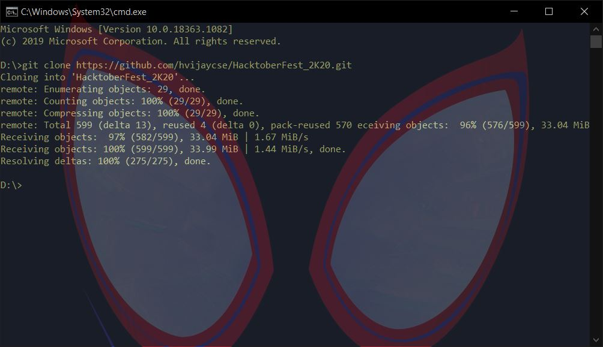

# HacktoberFest_2K20
Happy Hacktoberfest! :octocat: this repo is for HacktoberFest 2020, either its your first time using Github, first PR or a professional, aim of this reporistory is to help everyone to contribute, make one more PR and get the perk of contribution [Free Tshirt and Stickers].

# Hall of Fame 🔥⭐🔥
Check out the [Hall of Fame](https://hvijaycse.github.io/HacktoberFest_2K20/Hall_of_fame) for a list of contributors with a minimum of one commit with their gravatar. To know more about a contributor, click on the gravatar to go to their github profile.

# Hacktoberfest

So what is hacktoberfest exactly?
Hacktoberfest is an annual event organized by DigitialOcean and Dev
to motiviate everyone for start contributing to Open-Source by providing swags for your contribution to open-source, a free **tshirt** 👕 and cool stickers

# Getting started

- First thing first go to this [link](https://hacktoberfest.digitalocean.com/) and register yourself for hacktoberfest.

- Now if you already know about github and PR go on skip this step, otherwise visit these link [what is github](https://kinsta.com/knowledgebase/what-is-github/) and [how to create a pull request](https://www.digitalocean.com/community/tutorials/how-to-create-a-pull-request-on-github)

- So now you have registered and learned about github and pr this is what you need to do. You need to submit 4 pull request to any open repository, even yours own repo will count, after your 4 repo wait for 7 days, its the time duration introduced by github this year to validate your pullrequests.

- Also before submitting any pull request to any repository check issues of that repo, this year hacktoberfest is blacklisting repository that just allow user to add its name and other detail and make a pr count.
 Example - [This repo](https://github.com/Dhroov7/Hacktoberfest2019) and it's [issue](https://github.com/Dhroov7/Hacktoberfest2019/issues/270)

 # Code Of Conduct 
 - Just like other repository

 1. Star this repo if you like ⭐ 
 
 2. Fork 🍽️ this repo top right corner
 
 3. Clone your Repo

 >To make your own local copy of the repository you would like to contribute to, let’s first open up a terminal window.
We’ll use the git clone command along with the URL that points to your fork of the repository.
This URL will be similar to the URL above, except now it will end with .git. In the example above, the URL will look like this:

>https://github.com/your-username/HacktoberFest_2K20.git
You can alternatively copy the URL by using the green “Clone or download” button from your repository page that you just forked from the original repository page. Once you click the button, you’ll be able to copy the URL by clicking the binder button next to the URL:

>

4. Now you have the reporistory on your system make changes that you like for, add a new program correct some grammer in documentation. Anything change or new you would like to make on that reporistory. For this repository what you can do is explain below. 

5. Now that you have made changes run the commands
  >> `git add -A` 
  >> `git commit -m "here come you message about the changes"` 
  >> `git push origin master`

6. Now as you have learned above [how to create PR](https://www.digitalocean.com/community/tutorials/how-to-create-a-pull-request-on-github) go to you repository and make a pull request and wait for the maintianer to merge your pr. Here you go one pr done.

# For this Repository

## First
 - For beginner we have, we have created `Starter` directory there you can just add what you want like your first program you ever made, either in c , c++, JAVA, Python or any other if there is no directory of your programming laguage just create one and go on.
Beginners can also correct documents like this one, make changes in other programs, add new documentation, new ideas, just anything.

 - For Intermediate guys, you also have `Intermediate` directory everything for beginner also applies to you, what extra is for you, we all required to learn data structure and other subjects, add there programs or problems for these topics, this way you learn about other topics and other learns about yours.

 - For professionals, guys this repo is not for you, go contribute to big organizations, Just kidding you guys know what to do, just go on.

## Second
 - When you have made all the changes or created files, directory, documents, there is a file name [Contibutors.md](Contibutors.md)
 It follows a format, just add your name and profile link in the given format before you commit, push and make a pr. I might reject your pr if dont follow this step.  

# Bonus
> I have also created a [list](repository.md) of repositories for hacktoberfest 2019
> I found these repository good for First pr and organization wise, have a look at them and if you find a new repo for hacktoberfest it will be great if you can add this to the that file

# Best of Luck for Hacktoberfest and Your whole journey
> Why are you still here. Go and contribute...
